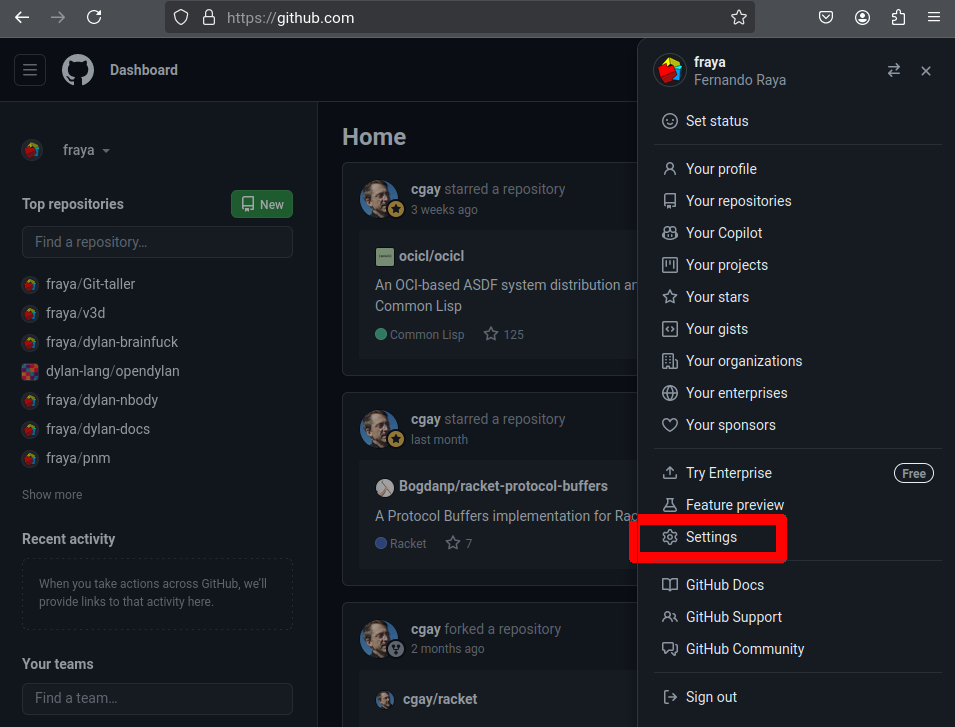
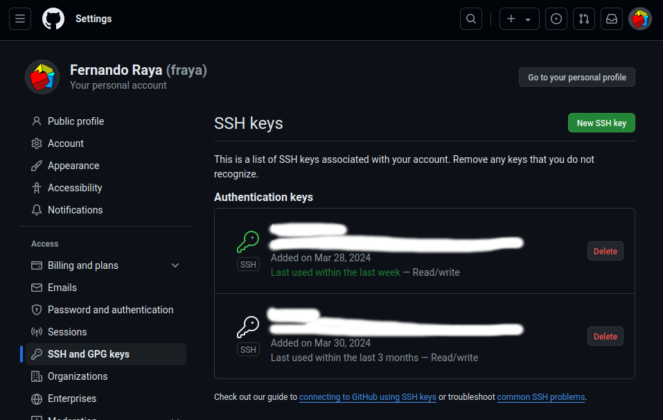
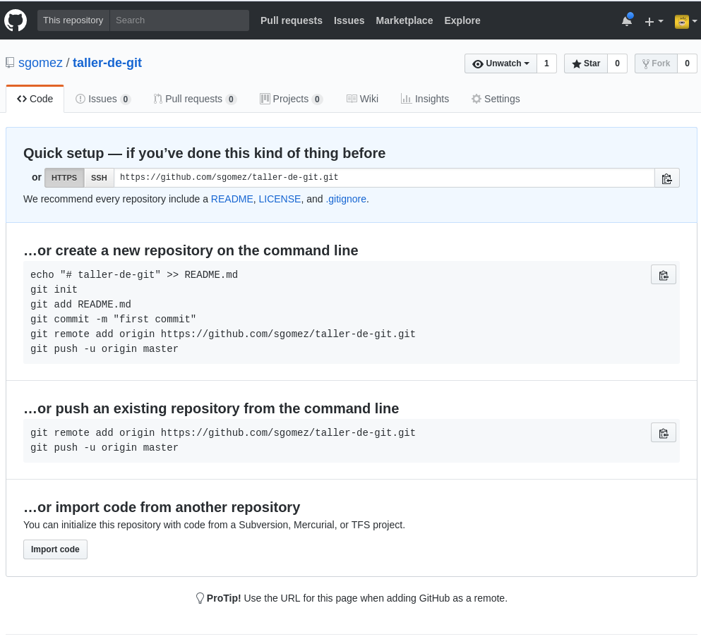
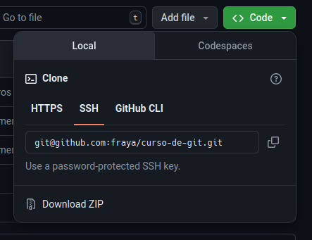
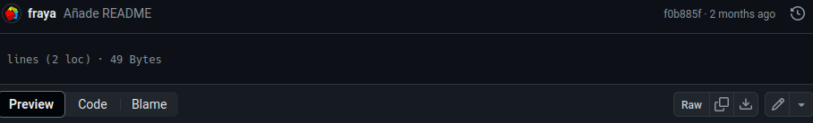
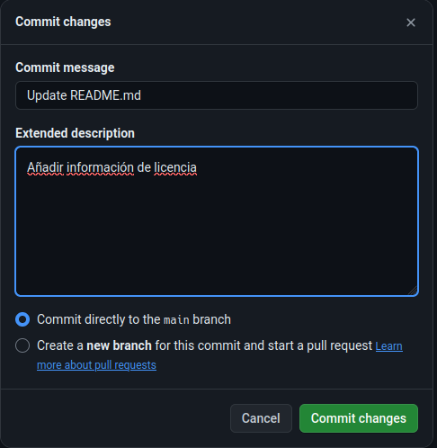

.. _`_github`:

Github
======

`Github <https://github.com>`__ es lo que se denomina una forja, un
repositorio de proyectos que usan Git como sistema de control de
versiones. Es la forja más popular, ya que alberga millones de
repositorios. Debe su popularidad a sus funcionalidades sociales,
principalmente dos: la posibilidad de hacer forks de otros proyectos y
la posibilidad de cooperar aportando código para arreglar errores o
mejorar el código. Si bien, no es que fuera una novedad, sí lo es lo
fácil que resulta hacerlo. A raíz de este proyecto han surgido otros
como `Gitlab <https://about.gitlab.com>`__, pero *Github* sigue siendo
el más popular y el que tiene mejores y mayores
características. algunas de estas son:

-  Un wiki para documentar el proyecto, que usa MarkDown como lenguaje
   de marca.

-  Un portal web para cada proyecto.

-  Funcionalidades de redes sociales como followers.

-  Gráficos estadísticos.

-  Revisión de código y comentarios.

-  Sistemas de seguimiento de incidencias.

Lo primero es entrar en el portal (https://github.com/) para crearnos
una cuenta si no la tenemos aún.

.. _`_tu_clave_públicaprivada`:

Tu clave pública/privada
------------------------

Muchos servidores Git utilizan la autentificación a través de claves
públicas SSH. Y, para ello, cada usuario del sistema ha de generarse
una, si es que no la tiene ya. El proceso para hacerlo es similar en
casi cualquier sistema operativo. Ante todo, asegurarte que no tengas ya
una clave. (comprueba que el directorio ``$HOME/usuario/.ssh`` no tiene
un archivo ``id_dsa.pub`` o ``id_rsa.pub``).

Para crear una nueva clave usamos la siguiente orden:

.. code-block:: console

   $ ssh-keygen -t ed25519 -C "tu_email@example.com"

.. note::

   Si estas usando un sistemas antiguo (*legacy*) que no soporte el
   algoritmo Ed25519 usa:

   .. code-block:: console

      $ ssh-keygen -t rsa -C "tu_email@example.com"

.. warning::

   Tu clave te identifica contra los repositorios remotos, asegúrate de
   no compartir la clave privada con nadie. Por defecto la clave se crea
   como *solo lectura*.

.. _`_configuración`:

Configuración
-------------

Vamos a aprovechar para añadir la clave RSA que generamos antes, para
poder acceder desde git a los repositorios. Para ellos nos vamos al menú
de configuración de usuario (*Settings*)

   Barra principal de menú

Nos vamos al menú *SSH and GPG Keys* y añadimos una nueva clave. En
*Title* indicamos una descripción que nos ayude a saber de dónde procede
la clave y en key volcamos el contenido del archivo
``~/.ssh/id_ed25519.pub``. Y guardamos la clave.

   Clave SSH

Con esto ya tendriamos todo nuestro entorno para poder empezar a
trabajar desde nuestro equipo.

.. _`_clientes_gráficos_para_github`:

Clientes gráficos para GitHub
-----------------------------

Además, para Github existe un cliente propio, `Github
desktop <https://desktop.github.com>`__ o `Github
CLI <https://cli.github.com>`__

De todas maneras, estos clientes solo tienen el fin de facilitar el uso
de Github, pero no son necesarios para usarlo. Es perfectamente válido
usar el cliente de consola de Git o cualquier otro cliente genérico para
Git. Uno de los más usados actualmente es
`GitKraken <https://www.gitkraken.com/>`__.

.. _`_crear_un_repositorio`:

Crear un repositorio
--------------------

Vamos a crear un repositorio donde guardar nuestro proyecto. Para ello
pulsamos el signo *+* que hay en la barra superior y seleccionamos
*New repository*.

Ahora tenemos que designar un nombre para nuestro repositorio, por
ejemplo: *taller-de-git*.

.. figure:: images/github-newrepo.png
   :alt: Nuevo repositorio

   Nuevo repositorio

Nada más crear el repositorio nos saldrá una pantalla con instrucciones
precisas de como proceder a continuación.

Básicamente podemos partir de tres situaciones:

1. Todavía no hemos creado ningún repositorio en nuestro equipo.

2. Ya tenemos un repositorio creado y queremos sincronizarlo con Github.

3. Queremos importar un repositorio de otro sistema de control de
   versiones distinto.

   Quick setup

.. _`_clonar_un_repositorio`:

Clonar un repositorio
---------------------

Una vez que tengamos el repositorio en Github, eventualmente vamos a
querer descargarlo en otro de nuestros ordenadores para poder trabajar
en él. Esta acción se denomina **clonar** y para ello usaremos la orden
``git clone``.

   Clonar o descargar

En la página principal de nuestro proyecto podemos ver un botón que
indica ``Code`. Si lo pulsamos aparece *clone* o *download*. Podemos
elegir entre clonar con *ssh* o *https*. Recordad que si estáis en
otro equipo y queréis seguir utilizando ssh deberéis generar otra para
de claves privada/pública como hicimos anteriormente e instalarla en
nuestro perfil de Github.

Para clonar nuestro repositorio y poder trabajar con él todo lo que
debemos hacer es lo siguiente:

.. code-block:: console

   $ git clone git@github.com:fraya/curso-de-git.git
   $ cd curso-de-git

.. _`_ramas_remotas`:

Ramas remotas
-------------

Si ahora vemos el estado de nuestro proyecto veremos algo similar a
esto:

.. code-block:: console

   $ git hist --all
   * 2eab8ca 2013-06-16 | Aplicando los cambios de la rama hola (HEAD -> master, origin/master) [Sergio Gomez]
   *\
   | * 9862f33 2013-06-16 | hola usa la clase HolaMundo (hola) [Sergio Gómez]
   | * 6932156 2013-06-16 | Añadida la clase HolaMundo [Sergio Gómez]
   |/
   * 9c85275 2013-06-16 | Programa interactivo (master) [Sergio Gómez]
   * c3e65d0 2013-06-16 | Añadido README.md [Sergio Gómez]
   * 81c6e93 2013-06-16 | Movido hola.php a lib [Sergio Gómez]
   * 96a39df 2013-06-16 | Añadido el autor del programa y su email [Sergio Gómez]
   * fd4da94 2013-06-16 | Se añade un comentario al cambio del valor por defecto (tag: v1) [Sergio Gómez]
   * 3283e0d 2013-06-16 | Se añade un parámetro por defecto (tag: v1-beta) [Sergio Gómez]
   * efc252e 2013-06-16 | Parametrización del programa [Sergio Gómez]
   * e19f2c1 2013-06-16 | Creación del proyecto [Sergio Gómez]

Aparece que hay una nueva rama llamada ``origin/master``. Esta rama
indica el estado de sincronización de nuestro repositorio con un
repositorio remoto llamado *origin*. En este caso el de *Github*.

.. note::

   Por norma se llama automáticamente *origin* al primer repositorio con
   el que sincronizamos nuestro repositorio.

Podemos ver la configuración de este repositorio remoto con la orden
``git remote``:

.. code-block:: console

   $ git remote show origin
   * remote origin
     Fetch URL: git@github.com:sgomez/taller-de-git.git
     Push  URL: git@github.com:sgomez/taller-de-git.git
     HEAD branch: master
     Remote branch:
       master tracked
     Local ref configured for 'git push':
       master pushes to master (up to date)

De la respuesta tenemos que fijarnos en las líneas que indican *fetch* y
*push* puesto que son las acciones de sincronización de nuestro
repositorio con el remoto. Mientras que *fetch* se encarga de traer los
cambios desde el repositorio remoto al nuestro, *push* los envía.

.. _`_enviando_actualizaciones`:

Enviando actualizaciones
------------------------

Vamos a añadir una licencia a nuestra aplicación. Creamos un fichero
LICENSE con el siguiente contenido:

.. code-block:: console

   MIT License

   Copyright (c) [year] [fullname]

   Permission is hereby granted, free of charge, to any person obtaining a copy
   of this software and associated documentation files (the "Software"), to deal
   in the Software without restriction, including without limitation the rights
   to use, copy, modify, merge, publish, distribute, sublicense, and/or sell
   copies of the Software, and to permit persons to whom the Software is
   furnished to do so, subject to the following conditions:

   The above copyright notice and this permission notice shall be included in all
   copies or substantial portions of the Software.

   THE SOFTWARE IS PROVIDED "AS IS", WITHOUT WARRANTY OF ANY KIND, EXPRESS OR
   IMPLIED, INCLUDING BUT NOT LIMITED TO THE WARRANTIES OF MERCHANTABILITY,
   FITNESS FOR A PARTICULAR PURPOSE AND NONINFRINGEMENT. IN NO EVENT SHALL THE
   AUTHORS OR COPYRIGHT HOLDERS BE LIABLE FOR ANY CLAIM, DAMAGES OR OTHER
   LIABILITY, WHETHER IN AN ACTION OF CONTRACT, TORT OR OTHERWISE, ARISING FROM,
   OUT OF OR IN CONNECTION WITH THE SOFTWARE OR THE USE OR OTHER DEALINGS IN THE
   SOFTWARE.

Y añadidos y confirmamos los cambios:

.. code-block:: console

   $ git add LICENSE
   $ git commit -m "Añadida licencia"
   [master 3f5cb1c] Añadida licencia
    1 file changed, 21 insertions(+)
    create mode 100644 LICENSE
   $ git hist --all
   * 3f5cb1c 2013-06-16 | Añadida licencia (HEAD -> master) [Sergio Gómez]
   * 2eab8ca 2013-06-16 | Aplicando los cambios de la rama hola (origin/master) [Sergio Gomez]
   *\
   | * 9862f33 2013-06-16 | hola usa la clase HolaMundo (hola) [Sergio Gómez]
   | * 6932156 2013-06-16 | Añadida la clase HolaMundo [Sergio Gómez]
   |/
   * 9c85275 2013-06-16 | Programa interactivo (master) [Sergio Gómez]
   * c3e65d0 2013-06-16 | Añadido README.md [Sergio Gómez]
   * 81c6e93 2013-06-16 | Movido hola.php a lib [Sergio Gómez]
   * 96a39df 2013-06-16 | Añadido el autor del programa y su email [Sergio Gómez]
   * fd4da94 2013-06-16 | Se añade un comentario al cambio del valor por defecto (tag: v1) [Sergio Gómez]
   * 3283e0d 2013-06-16 | Se añade un parámetro por defecto (tag: v1-beta) [Sergio Gómez]
   * efc252e 2013-06-16 | Parametrización del programa [Sergio Gómez]
   * e19f2c1 2013-06-16 | Creación del proyecto [Sergio Gómez]

Viendo la historia podemos ver como nuestro master no está en el mismo
punto que ``origin/master``. Si vamos a la web de *Github* veremos que
``LICENSE`` no aparece aún. Así que vamos a enviar los cambios con la
primera de las acciones que vimos ``git push``:

.. code-block:: console

   $ git push -u origin master
   Counting objects: 3, done.
   Delta compression using up to 4 threads.
   Compressing objects: 100% (3/3), done.
   Writing objects: 100% (3/3), 941 bytes | 0 bytes/s, done.
   Total 3 (delta 0), reused 0 (delta 0)
   To git@github.com:sgomez/taller-de-git.git
      2eab8ca..3f5cb1c  master -> master
   Branch master set up to track remote branch master from origin.

.. note::

   La orden ``git push`` necesita dos parámetros para funcionar: el
   repositorio y la rama destino. Así que realmente lo que teníamos que
   haber escrito es:

   ::

      $ git push origin master

   Para ahorrar tiempo escribiendo *git* nos deja vincular nuestra rama
   local con una rama remota, de tal manera que no tengamos que estar
   siempre indicándolo. Eso es posible con el parámetro
   ``--set-upstream`` o ``-u`` en forma abreviada.

   .. code-block:: console

      $ git push -u origin master

   Si repasas las órdenes que te indicó Github que ejecutaras verás que
   el parámetro ``-u`` estaba presente y por eso no ha sido necesario
   indicar ningún parámetro al hacer push.

.. _`_recibiendo_actualizaciones`:

Recibiendo actualizaciones
--------------------------

Si trabajamos con más personas, o trabajamos desde dos ordenadores
distintos, nos encontraremos con que nuestro repositorio local es más
antiguo que el remoto. Necesitamos descargar los cambios para poder
incorporarlos a nuestro directorio de trabajo.

Para la prueba, Github nos permite editar archivos directamente desde la
web. Pulsamos sobre el archivo ``README.md``. En la vista del archivo,
veremos que aparece el icono de un lápiz. Esto nos permite editar el
archivo.

   Editar archivo

.. note::

   Los archivos con extensión ``.md`` están en un formato denominado
   *MarkDown*. Se trata de un lenguaje de marca que nos permite escribir
   texto enriquecido de manera muy sencilla.

Modificamos el archivo como queramos, por ejemplo, añadiendo nuestro
nombre:

.. code-block:: console

   # Curso de GIT

   Este proyecto contiene el curso de introducción a GIT

   Desarrollado por Sergio Gómez.

   Confirmar cambios

El cambio quedará incorporado al repositorio de Github, pero no al
nuestro. Necesitamos traer la información desde el servidor remoto. La
orden asociada es ``git fetch``:

.. code-block:: console

   $ git fetch
   $ git hist --all
   * cbaf831 2013-06-16 | Actualizado README.md (origin/master) [Sergio Gómez]
   * 3f5cb1c 2013-06-16 | Añadida licencia (HEAD -> master) [Sergio Gómez]
   * 2eab8ca 2013-06-16 | Aplicando los cambios de la rama hola [Sergio Gomez]
   *\
   | * 9862f33 2013-06-16 | hola usa la clase HolaMundo (hola) [Sergio Gómez]
   | * 6932156 2013-06-16 | Añadida la clase HolaMundo [Sergio Gómez]
   |/
   * 9c85275 2013-06-16 | Programa interactivo (master) [Sergio Gómez]
   * c3e65d0 2013-06-16 | Añadido README.md [Sergio Gómez]
   * 81c6e93 2013-06-16 | Movido hola.php a lib [Sergio Gómez]
   * 96a39df 2013-06-16 | Añadido el autor del programa y su email [Sergio Gómez]
   * fd4da94 2013-06-16 | Se añade un comentario al cambio del valor por defecto (tag: v1) [Sergio Gómez]
   * 3283e0d 2013-06-16 | Se añade un parámetro por defecto (tag: v1-beta) [Sergio Gómez]
   * efc252e 2013-06-16 | Parametrización del programa [Sergio Gómez]
   * e19f2c1 2013-06-16 | Creación del proyecto [Sergio Gómez]

Ahora vemos el caso contrario, tenemos que ``origin/master`` está por
delante que ``HEAD`` y que la rama ``master`` local.

Ahora necesitamos incorporar los cambios de la rama remota en la
local.  La forma de hacerlo lo vimos en el capítulo anterior mezclar
ramas usando ``git merge`` o ``git rebase``.

Habitualmente se usa ``git merge``:

.. code-block:: console

   $ git merge origin/master
   Updating 3f5cb1c..cbaf831
   Fast-forward
    README.md | 2 ++
    1 file changed, 2 insertions(+)
   $ git hist --all
   * cbaf831 2013-06-16 | Actualizado README.md (HEAD -> master, origin/master) [Sergio Gómez]
   * 3f5cb1c 2013-06-16 | Añadida licencia [Sergio Gómez]
   * 2eab8ca 2013-06-16 | Aplicando los cambios de la rama hola [Sergio Gomez]
   *\
   | * 9862f33 2013-06-16 | hola usa la clase HolaMundo (hola) [Sergio Gómez]
   | * 6932156 2013-06-16 | Añadida la clase HolaMundo [Sergio Gómez]
   |/
   * 9c85275 2013-06-16 | Programa interactivo (master) [Sergio Gómez]
   * c3e65d0 2013-06-16 | Añadido README.md [Sergio Gómez]
   * 81c6e93 2013-06-16 | Movido hola.php a lib [Sergio Gómez]
   * 96a39df 2013-06-16 | Añadido el autor del programa y su email [Sergio Gómez]
   * fd4da94 2013-06-16 | Se añade un comentario al cambio del valor por defecto (tag: v1) [Sergio Gómez]
   * 3283e0d 2013-06-16 | Se añade un parámetro por defecto (tag: v1-beta) [Sergio Gómez]
   * efc252e 2013-06-16 | Parametrización del programa [Sergio Gómez]
   * e19f2c1 2013-06-16 | Creación del proyecto [Sergio Gómez]

Como las operaciones de traer cambios (``git fetch``) y de mezclar ramas
(``git merge`` o ``git rebase``) están muy asociadas, *git* nos ofrece
una posibilidad para ahorrar pasos que es la orden ``git pull`` que
realiza las dos acciones simultáneamente.

Para probar, vamos a editar de nuevo el archivo README.md y añadimos
algo más:

.. code-block:: console

   # Curso de GIT

   Este proyecto contiene el curso de introducción a GIT del Aula de Software Libre.

   Desarrollado por Sergio Gómez.

Como mensaje del *commit*: *\`Indicado que se realiza en el ASL'*.

Y ahora probamos a actualizar con ``git pull``:

.. code-block:: console

   $ git pull
   remote: Counting objects: 3, done.
   remote: Compressing objects: 100% (3/3), done.
   remote: Total 3 (delta 0), reused 0 (delta 0), pack-reused 0
   Unpacking objects: 100% (3/3), done.
   From github.com:sgomez/taller-de-git
      cbaf831..d8922e4  master     -> origin/master
   First, rewinding head to replay your work on top of it...
   Fast-forwarded master to d8922e4ffa4f87553b03e77df6196b7e496bfec4.
   $ git hist --all
   * d8922e4 2013-06-16 | Indicado que se realiza en el ASL (HEAD -> master, origin/master) [Sergio Gómez]
   * cbaf831 2013-06-16 | Actualizado README.md [Sergio Gómez]
   * 3f5cb1c 2013-06-16 | Añadida licencia [Sergio Gómez]
   * 2eab8ca 2013-06-16 | Aplicando los cambios de la rama hola [Sergio Gomez]
   *\
   | * 9862f33 2013-06-16 | hola usa la clase HolaMundo (hola) [Sergio Gómez]
   | * 6932156 2013-06-16 | Añadida la clase HolaMundo [Sergio Gómez]
   |/
   * 9c85275 2013-06-16 | Programa interactivo (master) [Sergio Gómez]
   * c3e65d0 2013-06-16 | Añadido README.md [Sergio Gómez]
   * 81c6e93 2013-06-16 | Movido hola.php a lib [Sergio Gómez]
   * 96a39df 2013-06-16 | Añadido el autor del programa y su email [Sergio Gómez]
   * fd4da94 2013-06-16 | Se añade un comentario al cambio del valor por defecto (tag: v1) [Sergio Gómez]
   * 3283e0d 2013-06-16 | Se añade un parámetro por defecto (tag: v1-beta) [Sergio Gómez]
   * efc252e 2013-06-16 | Parametrización del programa [Sergio Gómez]
   * e19f2c1 2013-06-16 | Creación del proyecto [Sergio Gómez]

Vemos que los cambios se han incorporado y que las ramas remota y local
de *master* están sincronizadas.

.. _`_problemas_de_sincronización`:

Problemas de sincronización
---------------------------

.. _`_no_puedo_hacer_push`:

No puedo hacer push
~~~~~~~~~~~~~~~~~~~

Al intentar subir cambios nos podemos encontrar un mensaje como este:

.. code-block:: console

   $ git push
   git push
   To git@github.com:sgomez/taller-de-git.git
    ! [rejected]        master -> master (fetch first)
   error: failed to push some refs to 'git@github.com:sgomez/taller-de-git.git'
   hint: Updates were rejected because the remote contains work that you do
   hint: not have locally. This is usually caused by another repository pushing
   hint: to the same ref. You may want to first integrate the remote changes
   hint: (e.g., 'git pull ...') before pushing again.
   hint: See the 'Note about fast-forwards' in 'git push --help' for details.

La causa es que el repositorio remoto también se ha actualizado y
nosotros aún no hemos recibido esos cambios. Es decir, ambos
repositorios se han actualizado y el remoto tiene preferencia. Hay un
conflicto en ciernes y se debe resolver localmente antes de continuar.

Vamos a provocar una situación donde podamos ver esto en acción. Vamos a
modificar el archivo ``README.md`` tanto en local como en remoto a
través del interfaz web.

En el web vamos a cambiar el título para que aparezca de la siguiente
manera.

.. code-block:: console

   Curso de GIT, 2020

En local vamos a cambiar el título para que aparezca de la siguiente
manera.

.. code-block:: console

   Curso de GIT, febrero

!!! question

::

   Haz el commit para guardar el cambio en local.

??? example \``Respuesta al ejercicio anterior''

::

   Añadimos el fichero actualizado:

       $ git commit -am "Añadido el mes al README"
       [master 1e8c0b7] Añadido el mes al README
       1 file changed, 1 insertion(+), 1 deletion(-)

La forma de proceder en este caso es hacer un ``git fetch`` y un ``git
rebase``. Si hay conflictos deberán resolverse. Cuando esté todo
solucionado ya podremos hacer ``git push``.

.. note::

   Por defecto `git pull` lo que hace es un `git merge`, si queremos
   hacer `git rebase` deberemos especificarlos con el parámetro `-r`:

   .. code-block:: console
		   
       $ git pull --rebase

Vamos a hacer el pull con rebase y ver qué sucede.

.. code-block:: console

   $ git pull --rebase
   First, rewinding head to replay your work on top of it...
   Applying: Añadido el mes al README
   Using index info to reconstruct a base tree...
   M   README.md
   Falling back to patching base and 3-way merge...
   Auto-merging README.md
   CONFLICT (content): Merge conflict in README.md
   error: Failed to merge in the changes.
   Patch failed at 0001 Añadido el mes al README
   hint: Use 'git am --show-current-patch' to see the failed patch

   Resolve all conflicts manually, mark them as resolved with
   "git add/rm <conflicted_files>", then run "git rebase --continue".
   You can instead skip this commit: run "git rebase --skip".
   To abort and get back to the state before "git rebase", run "git rebase --abort".

Evidentemente hay un conflicto porque hemos tocado el mismo archivo. Se
deja como ejercicio resolverlo.

??? example \``Respuesta al ejercicio anterior''

::

   El contenido del fichero final podría ser:

       Curso de GIT, febrero, 2020

   A continuación confirmamos los cambios y los enviamos al servidor

       $ git add README.md
       $ git rebase --continue
       $ git push

.. warning::

   ¿Por qué hemos hecho rebase en master si a lo largo del curso hemos
   dicho que no se debe cambiar la linea principal?

   Básicamente hemos dicho que lo que no debemos hacer es modificar la
   línea temporal **compartida**. En este caso nuestros cambios en
   *master* solo estaban en nuestro repositorio, porque al fallar el
   envío nadie más ha visto nuestras actualizaciones. Al hacer
   *rebase* estamos deshaciendo nuestros cambios, bajarnos la última
   actualización compartida de *master* y volviéndolos a aplicar. Con
   lo que realmente la historia compartida no se ha modificado.

Este es un problema que debemos evitar en la medida de lo posible. La
menor cantidad de gente posible debe tener acceso de escritura en
master y las actualizaciones de dicha rama deben hacerse a través de
ramas secundarias y haciendo merge en master como hemos visto en el
capítulo de ramas.

.. _`_no_puedo_hacer_pull`:

No puedo hacer pull
~~~~~~~~~~~~~~~~~~~

Al intentar descargar cambios nos podemos encontrar un mensaje como
este:

.. code-block:: console

   $ git pull
   error: Cannot pull with rebase: You have unstaged changes.

O como este:

.. code-block:: console

   $ git pull
   error: Cannot pull with rebase: Your index contains uncommitted changes.

Básicamente lo que ocurre es que tenemos cambios sin confirmar en
nuestro espacio de trabajo. Una opción es confirmar (*commit*) y
entonces proceder como el caso anterior.

Pero puede ocurrir que aún estemos trabajando todavía y no nos
interese confirmar los cambios, solo queremos sincronizar y seguir
trabajando.  Para casos como estos *git* ofrece una pila para guardar
cambios temporalmente. Esta pila se llama *stash* y nos permite
restaurar el espacio de trabajo al último commit.

De nuevo vamos a modificar nuestro proyecto para ver esta situación en
acción.

.. container:: informalexample

   En remoto borra el año de la fecha y en local borra el mes. Pero esta
   vez **no hagas commit en local**. El archivo solo debe quedar
   modificado.

La forma de proceder es la siguiente:

::

   $ git stash save # Guardamos los cambios en la pila
   $ git pull # Sincronizamos con el repositorio remoto, -r para hacer rebase puede ser requerido
   $ git stash pop # Sacamos los cambios de la pila

.. note::

   Como ocurre habitualmente, git nos proporciona una forma de hacer
   todos estos pasos de una sola vez. Para ello tenemos que ejecutar lo
   siguiente:

   .. code-block:: console

      $ git pull --autostash

   En general no es mala idea ejecutar lo siguiente si somos
   conscientes, además, de que tenemos varios cambios sin sincronizar:

   .. code-block:: console

      $ git pull --autostash --rebase

Podría darse el caso de que al sacar los cambios de la pila hubiera
algún conflicto. En ese caso actuamos como con el caso de *merge* o
*rebase*.

De nuevo este tipo de problemas no deben suceder si nos acostumbramos
a trabajar en ramas.
