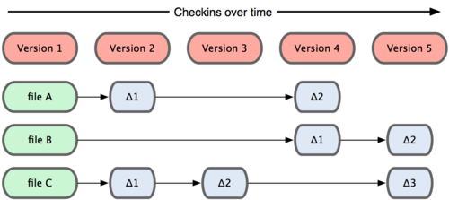
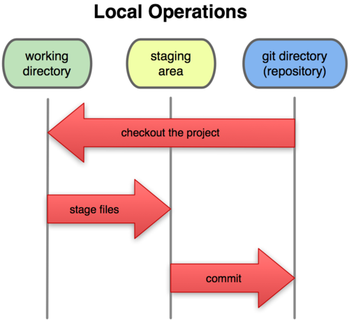

.. _`_introducción_a_git`:

Introducción a git
==================

`Git <https://git-scm.com>`__ es un sistema de control de versiones
distribuido que se diferencia del resto en el modo en que modela sus
datos.

La mayoría de los demás sistemas almacenan la información como
una lista de cambios (deltas) en los archivos.

   Modelo de datos de los sistemas distribuidos tradicionales

Mientras que Git modela sus datos más como un conjunto de instantáneas
de un mini sistema de archivos.

.. figure:: images/distribuido-git.png
   :alt: Modelo de datos de Git

   Modelo de datos de Git

Los tres estados de un fichero
------------------------------

Git tiene tres estados principales en los que se pueden encontrar tus
archivos: **modificado** (*modified*), **preparado** (*staged*) y
**confirmado** (*committed*).

.. graphviz::
   :alt: Estados de un archivo
   :align: center

   digraph estados {
     rankdir="LR";
     graph [fontname="Verdana", fontsize="12"];
     node  [fontname="Verdana", fontsize="12", shape=box, color=grey];
     edge  [fontname="Sans", fontsize="9"];
     
     Modified -> Staged[label="add"];
     Staged -> Commited[label="commit"];
     Staged -> Modified[label="restore/reset"];
   }

**Modified** o modificado
   significa que has modificado el archivo pero todavía no lo has
   confirmado a tu base de datos.

**Staged** o preparado
   significa que has marcado un archivo modificado en su versión actual
   para que vaya en tu próxima confirmación.

**Commited** o confirmado
   significa que los datos están almacenados de manera segura en tu base
   de datos local.

Las tres secciones principales de un proyecto
---------------------------------------------

Las tres secciones principales de un proyecto de Git son: el
directorio de Git (*Git directory*), el directorio de trabajo (*working
directory*), y el área de preparación (*staging area*).

   Directorio de trabajo, área de preparación, y directorio de Git

**Git directory**
   donde está almacenada toda la información del repositorio
   (directorio ``.git`` de nuestro proyecto).

**Staging area**
   los ficheros que están en seguimiento para ser incluidos en nuestro
   siguiente *commit*.

**Working directory**
   todos los ficheros y directorios con los que trabajamos incluyendo
   ficheros que pueden no pertenecer a nuestro proyecto y no tener
   seguimiento aún.
